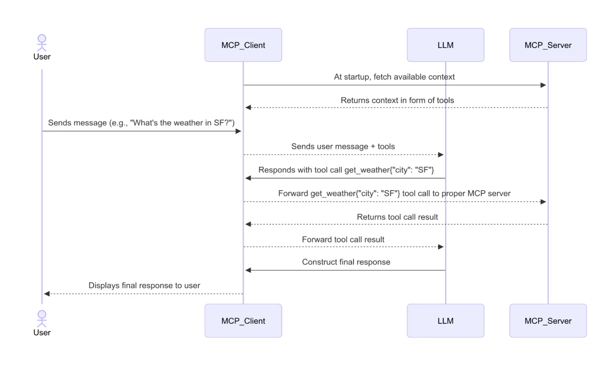

# Personal notes

## GPU Architecture

### Streaming Multiprocessors

A GPU consists of many Straming Multiprocessors (SM) working in parallel.

An SM is a collection of specialized units designed to work together to execute GPU kernels efficiently. It creates, manages, schedules, and executes threads in groups of 32 parallel threads called warps. One SM can manage between 32 and 64 warps and the exacte number of blocks one SM can manage depends on how many threads are allocated in a block. Typically, one block can contain up to 1024 threads (32 warps) and one SM can manage up to 2048 threads divided in several blocks. In other words, the number of block one SM can manage depends on the number of threads per block.

Each SM contains cores (SP), warps schedulers, registers, shared memory and loading/storing units to perfom operations. It is important to choose a correct kernel configuration based on the operations performed to avoid instruction divergence. It is better to make all the threads inside a warp perfom the same operation, it is possible that they perform different operation  but it will be less efficient.

For instance the following operation is efficient as each thread will perform the same operation, an addition. If half of the thread had to do a substraction instead, they would have to run this cycle twice, one for each operation.

```
C[i]=A[i]+B[i] 
```

will be executed in parallel 
```
C[1]=A[1]+B[1] 
C[2]=A[2]+B[2] 
:
:
```

A GPU's (SM) boosts efficiency and hides latency by concurrently managing many active warps. If one warp gets stoped for instance, while waiting for data from memory, the SM's scheduler can instantly switch to another warp that's ready to go, ensuring its execution units stay busy. This rapid switching between warps is crucial for making the GPU appear faster overall.

In additon, a single warp can only execute one instruction at a time across all its 32 threads simultaneously. If threads within the same warp try to perform different operations or follow different execution paths (warp divergence), the hardware has to process these divergent paths one after another. This serialization means some threads in the warp temporarily become idle, which ultimately reduces performance.

One SM can execute more or less operations per cycle depeding on the type of operation.


For instance if you have one warp, 32 threads, and need to perform an operation using an SFU able to only perform 4 ops per cycle, it will take 8 cycle to perform the operation on the entire warps.

**`Self thought`**  
Each thread is a list of instruction to perform. In a GPU a warp is an array of thread that perform the same instructions. So same instruction but multiple data SIMD. Let's say you have to add two vectors, the instructions will be go fetch the data, load them in register and add them together. A warp will have the same instruction but fetch and handle different data. 


### Streaming Processor

A Streaming Processor (SP), also called a cuda core, is the central part of the GPU, it makes up a good part of SMs (among other block such as LD/ST and SFU...). They are the actual arithmetic and logic units that perform the calculations, each of them are specialized in doing different kind of operations. 

Usually there are between 32 and 128 SP in a SM, and the role of the SM is to use the SP available to perform operations. It sends batches of 32 threads at the same time performing the same operation. In other words,
a total of 32 instructions can be dispatched to any of the blocks in a SM.

## Memory

### Coalesced access

Matrices in memory are represented as a concatenated list of vectors. These two following matrix:

```
[a b   [e f
 c d]   g h]
```
Are represented in memory as:
```
[a b c d e f g h]
```

Let's say you want to add these two matrices. Each thread is in charge of adding a single element of the two matrices together. Then one thread will use the formula 2*row+col to access the i row,col element. 
For 2 threads you have 
``` 
thread 1: a, e
thread 2: b, f
thread 3: c, g
thread 4: d, h
```
Clearly, the first access to memory searching for a, b, e and g is consecutive. The first memory lookup will load a, b, c, d; the second lookup will load e, f, g, h ready for the addition. Then thread 1 can compute a+e, thread b+f etc... Making the operation highly parallelizable and coalesced. 

If organized like that:
``` 
thread 1: a, b
thread 2: c, d
thread 3: e, f
thread 4: g, h
```
The search for a, c, e, g and then b, d, f, h will take longer as they are not stored next to each other. The consecutive memory lookup is faster than a scattered memory lookup.

The formal definition: If, in a warp, thread 0 accesses location n, thread 1 accesses location n + 1, . . . thread 31 accesses location n + 31, then all these accesses are coalesced, that is: combined into one single access.

Adjacent data are accessed by adjacent threads.

### Cache Memory

Each SM has its own cache memory acces (L1). It makes data retrieving fast since the program does not have to fetch data from the global shared memory. One of the reason why coalesced memory is fast is that when the program needs data in the global shared memory it actually fetches more data than asked. In other words if you need data at address 0 it will also fetch data from 10 following addresses and load it into cache memroy. The program can then access this data even if did not ask for it making it super fast. It is why you coalesced acces is so fast, you store the data from your vector/matrices close to each other so when you fetch it your cache can hold it. 

### Shared Memory

On chip shared memory (SRAM) is directly located on the SM chip. Space is limited and hence it can only hold little amount of data (50-200KB per SM). However it is fast to access, way faster than DRAM. So for a large matrix multiplication instead of repeatedly fetching data from DRAM for each thread, it loads small tiles of the matrix in SRAM to perform sub operations on it. It can then combine the operations to find the overall result.

Each thread block has a small portion of that SM shared memory (more or less L1 cache) depending on how many blocks the SM runs. It is private and other SM cannot access it. On the other hand, L2 cache is accessible by all SM and is on the gpu chip. It helps maintain a consistent view of global memory for all SMs.

Before checking if requested data is in DRAM the SM checks if it is in shared memory or L1/L2 cache

## Application

### Matrix multiplication

Matrices are stored in row major order in C and hence it is fast and efficient to access a entire row. However fetching a column make it less efficient since each element of a column is scattered appart. It is possible to use the transpose of a matrix in this case for better performance.

Another solution is to split matrices into tiles which result in smaller memory shared and faster access to it.Instead of loading the entire matrix in global memory you load a tile in shared memory for fast access.

### Big matrix multiplication
The process of combining many small matrices into one bigger matrix can lead to efficient matrix operation. It calls the kernel once, instead of making many calls to the kernel in charge of matrix multiplication. Calling the same kernel repeatedly is a waste of time in terms of setting up GPU execution especially for small matrices not utilizing full gpu power.

### Indexing

1 - 1D Indexing
A GPU is made of a grid which contains blocks and threads inside each block. One block can contain up to 1024 thread and are divided into groups of 32 threads which are called warps. Each thread is repsonsible for part of the overall operation making the overall operation highly paralelizable. 

A thread block captures the notion of a group of thread doing the same thing.

To access the ith thread in a 1D grid indexing we use this formula: 

```etting up GPU execution, memory access,
i = blockId.x * blockDim.x + threadId.x
```

It is up to the programer to set up enough blocks and threads per block for the operation required. 

For instance in a dot product the ith thread will be responsible to multiple the ith terms together in each vector.


### Compiled Code

When CUDA code is compiled with nvcc, the result is a binary that contains both host (CPU) code and device (GPU) code. The GPU code is compiled into PTX (Parallel Thread Execution) or SASS (native GPU assembly), and embedded inside the binary as data sections. C is code is just copiled by a regular compiler. During runtime, when the CPU reaches a kernel launch, it triggers a CUDA runtime API call like cudaLaunchKernel. This API call acts as a signal: it loads the appropriate GPU function, copies the relevant arguments to GPU memory, and instructs the CUDA driver to transfer the compiled GPU code to the device (if it’s not already resident). Then the GPU begins execution of the kernel in parallel. So while the CPU does initiate the GPU work, the GPU executes the compiled kernel code independently on its many cores.


The CPU does: 
Allocates memory on the GPU via API calls (cudaMalloc)
Copies data from CPU memory to GPU memory (cudaMemcpy)
Launches the GPU kernel via the special <<<...>>> syntax
Waits for GPU execution to finish (implicitly or explicitly via synchronization)
Copies results back
Cleans up


The precise compiled code generated by nvcc and what it does to lunch the kernel, allocate memory and flags when it is time to give the hand to the gpu is not available. Two different compiled codes, the cpu execute the overall compiled file and flags must give the hand to the gpu accessing gpu compiled instructions. 

From the profiler we can clearly observe that the api kernel calls are lunched sequentially and really fast, the cuda part are then executed but there is a latency in the execution. Some kernel takes time to finish and then there must be some sort of queue managed by the gpu to handle the multiple kernel calls. 


## LLM Architetcure


### Multi Head Attention

One self attention block is composed of multiple heads. Each head receive a fraction of the embedding of all input tokens. So each head will focus on different meaning perspective of each word.

For isntance: 
You have h = 32 heads. The embedding dimension is d_model = 4096 (your llama embedding_length). Each head works with vectors of size d_head = d_model / h = 4096 / 32 = 128. So each head will receive an input of size seq_length x 128, so that the total of the dimensions makes up the total embedding dimension. Then each output is stacked along the feature dimension seq_length x 4096 and a last linear transformation is applied for again a final size of seq_length x 4096.

In a model that is decoder only, the decoder part only contains a masked multi head attention. It does not contain a regular multi head attention. It is to avoid the model to look at future token ahead that would corupt their behavior. 

### Expert and Block selection

Mistral model is a decoder only model. In general these models are particularly good at contextual understanding. Models nowadays are made of decoder only architetcure types.

A transformer model has multiple blocks (sometimes called layers), stacked one after the other. In a Mixture of Experts (MoE) transformer, the feed-forward network (FFN) part inside each block is replaced by multiple experts — say 8 experts per block.

Each block has its own set of experts. So if your model has 32 blocks and 8 experts per block, you actually have 256 experts total (8 experts × 32 blocks).

At each block during inference or training, a gating mechanism selects a subset of these experts (for example, 2 out of 8) to process the input at that layer. So each block still has a single self-attention mechanism, with multiple heads inside it, and one MoE layer in place of a regular FFN.

After the self attention, the output of the block is passesd into a gate that routes it to a small number of expert withing the FFN section of the same block. In other words, It computes routing weights to select the top k = 2 experts. Each selected expert is essentially a small feed-forward network (MLP) and their outputs are usually combined.

* Visual Flow  
```
x -> LayerNorm
  -> Multi-Head Self-Attention (32 heads)
    -> +residual -> LayerNorm
      -> Gate decides: use Expert 3 and Expert 7 (out of 8)
        -> Combine their outputs
          -> +residual -> next block
```


### Incorporation

Shared Experts Across Blocks:
There’s a global pool of experts, 8 in total for instance. Only some Transformer blocks use MoE layers and when a block uses MoE, it selects from the global expert pool. This reduces the total number of parameters and allows reuse of expert weights across layers.

See this [notebook](../../HuggingFace/dummy_input.ipynb) for an example.


### Proposition

Decrease the expert pool down to just 2 experts. Keep only those 2 experts’ weights, removing the others. During inference, force the router to always pick those 2 experts.
Result: it makes a much smaller model, potentially still competent at a specific task.

The way to do that is to train a model to always choose these two expert good at soemething. Import a model and fine tune it to only update the weight of the expert selection. Find a way to remove the weight of the expert selection.


Roadmap: 
Run inference profiling: Use logging or probes to track which experts are selected across many prompts.
Identify the top experts: E.g., if experts 3 and 7 are selected 95% of the time for your domain (say, legal documents).
Prune others: Remove weights and possibly simplify the model architecture.
Force routing: Hard-code the gating mechanism to use those 2 only.

This [notebook](../../HuggingFace/dummy_input.ipynb) walks through example of prompts and categorizations with heat maps showing how much each expert is chosen depending on the situation.

Paper related: https://arxiv.org/pdf/2402.14800, https://arxiv.org/pdf/2410.12013 
GitHub Related: https://github.com/vllm-project/vllm


Data Collection/Analysis

For each token in each MoE layer, record:

The token itself (decoded).
The input prompt it came from.
The layer index.
The IDs of the chosen experts
The router scores for those chosen experts.

Frequency Counts: For each expert count how many times it was chosen across your entire dataset. This gives a general idea of its activity level.
Contextual Grouping: The most insightful step is to group the tokens/prompts by the experts they activated.
Example: If you find that Expert 3 is overwhelmingly chosen for tokens like "def", "import", "class", "for" in Python code, or "function", "variable", "loop" in natural language about programming, you can hypothesize that "Expert 3 is a 'coding expert'."
If Expert 5 is frequently chosen for numbers, mathematical symbols (+, -, =, sqrt), or words like "solve", "equation", "calculate", it might be a "mathematics expert."
If Expert 7 is often chosen for tokens in French, it might be a "French language expert."
If specific experts are consistently chosen for the names of famous people or places in factual questions, they might be "knowledge retrieval experts."
Layer-Specific Analysis: Some experts might specialize at different levels of abstraction. An expert in an early layer might identify parts of speech, while an expert in a later layer might identify coreferences or abstract concepts.
Visualization: Tools like word clouds for the tokens associated with an expert, or heatmaps showing expert activation patterns across layers for different input types, can be very illustrative.


### MoE Clarification

Turns out, this porposition does not work and is not efficient. The way the experts are chosen by the gate is inherent to the model and the training associated. Therefore, it is not possible to desactivate an expert as it is linked to the gate inherently by the training part. 

Here is the reason

In a Mixture of Experts (MoE) model, the Gate Layer determines which expert(s) should process each input token. 

Each token in the sequence is represented as a hidden vector:

h: shape (batch_size, seq_len, hidden_dim)
Example: (1, 1, 4096)

The gate layer uses a linear projection to map the hidden state to logits over all available experts. It uses a weight matrix shaped like:
W_gate: shape (n_experts, hidden_dim)
Example: (8, 4096)
The computation is:
router_logits = h x W_gate.T
Output shape: (n_experts,)

Each logit reflects how relevant a given expert is for this token.

This is where we see that the W_gate matrix that was learned is crucial in this process. It knows how to select each expert and hence if we desactivate some of them it will not perform at its best. It works with the experts closely.

The rest of the operations are:

Apply softmax() to the router logits to get routing weights:
routing_weights = softmax(router_logits)
Select the top-k experts based on the highest weights.
Send the token (hidden state vector) only to those selected experts.
Each selected expert processes the input and produces its own output vector.
The final output for the token is a weighted sum of the outputs of the selected experts:
output = weight_1 * expert_1_output + weight_2 * expert_2_output
This weighted combination ensures that the influence of each expert is proportional to the routing decision.

Graphical rep: 
```
Hidden State h → Gating Network → [0, 0.8, 0, 0.2, 0, 0, 0, 0]  (example)
                 ↓                           ↓         
               Select Expert 1 (0.8)     + Expert 3 (0.2)
                 ↓                             ↓
               FFN(h)                        FFN(h)
                 ↓                             ↓
            0.8 * FFN(h)               +   0.2 * FFN(h)
```


## LLM Training/Inference generation

### Training/Inference

The LLM works differently during training and during inference. During training the LLM will receive entire sentences but with system like mask layer it will be able to only see some part of the sentence and its goal will be to complete the masked or missing words.


During inference depending on the tasked the LLM will either process the entire context or just generate step by step tokens and incorporate them in its context. 
For a sentiment classification it will look at the entire context and its goal will be to output the general sentiment of the context.
For a question, it will incorporate the entire question and for each token predicted it will be added in the context and the entire sentence generated process again and again.

Example 
```
Input: "The cat sat on the"
Model → Predict: "mat"
Now input: "The cat sat on the mat"
Model → Predict: "."
And so on...
```


### Word Genertaion

The model uses the last hidden vector to generate the next word. The model has created a hidden vector for each token of the context and input, but it only use the last one to predict the new word/token.

This vector is passed through a linear layer (called the "language modeling head") that projects it onto a vocabulary sized vector:

```
logits = W_out @ h + b
shape: (vocab_size,)
```
Then a softmax fucntion is applied to associate a probability to each word. A selection of the word is made and it is then happened to the context. 


## MCP Connections

### Goal 

The core large language model generates language predictions based on input text. It has a fixed knowledge cutoff and does not natively access live data or APIs.

Controller / Processor (MCP)
This acts as an orchestrator or intermediary between the LLM and external systems. It can:
- Interpret the LLM’s request to fetch or process data.
- Call APIs, databases, or knowledge bases.
- Process and filter external data.
- Format results to feed back into the LLM’s input context.

Data sources (Outside world)
These can be real-time APIs, databases, IoT sensors, websites, or any other live data repository.

Below is a simplified diagram of how MCP works in the context of LLM fetching external information.

```
User prompt: "Show me today's stock price for AAPL."

↓ (Input to LLM)

LLM: "I need stock price for AAPL." (signals controller)

↓

Controller:

- Calls stock price API
- Gets current price $XYZ
- Formats: "Current price for AAPL is $XYZ."

↓

Controller sends this info back to LLM as context

↓

LLM: Generates response incorporating live price

↓

User sees final answer with up-to-date data.
```

### Functionning

The diagram below shows how the mcp protocol works.



The mcp client fetches the tools it has available. Then it routes the requests of the user to the correct tools needed. The mcp itself does not really take the decision, it rather send the request to the LLM with the available tools and with prompt engineering, if the LLM needs external tools it will return a specific format to the mcp client. 

For instance this can be the prompt of an LLM: 
```
You can use the following tools:

- getWeather(city): returns current weather
- getStockPrice(ticker): returns stock price
...

When you don’t know something, respond with:
Action: <tool_name>
Action Input: <input>

Otherwise, answer directly.
```
 
It is the same LLM used everytime but it knows what it can do or not. Then the mcp depending on the answer returned knows what to do next. 

In some cases, a first small LLM is used to route the request made.


