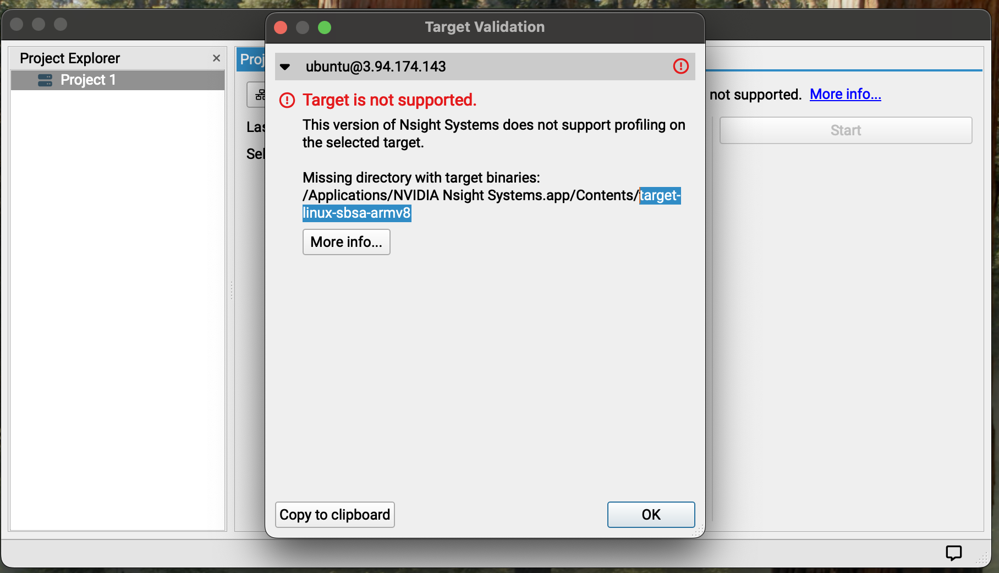
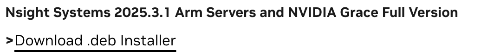
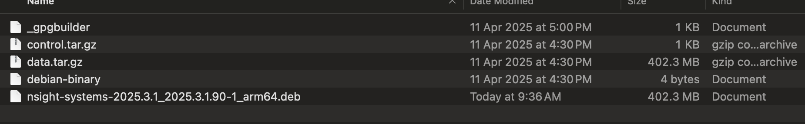

# Objectives

Install and connect to NSight for debugging and profiling.

# Install NSight

1 - Download the latest version of NSight Visual Studio Edition from the NVIDIA developer website:
https://developer.nvidia.com/nsight-systems/get-started


When you launch, ensure tha the foloowing configuration is in your ssh: Users/[yourusername]/.ssh/config

```bash
Host 3.94.174.143
	HostName 3.94.174.143
	IdentityFile path_to_the_key/GPU-KEY.pem
	User ubuntu
```

You will have the following error:




2 - Download the debian package
https://developer.nvidia.com/nsight-systems/get-started




3 - Then untar the package:

```bash
tar -xvf nsight-systems-2025.3.1_2025.3.1.90-1_arm64.deb
```

You will have the following files:


Unzip the data.tar.xz file:
```bash
tar -xvf data.tar.xz
```

then navigate insisde the folder and get the target-linux-sbsa-armv8 folder.

Copy in your application as displayed in the error message


# Connect to NSight

You can successfuly use Nvidia Nsight to profile gpu code. 

# Connect Visual Studio to the server

Via SSH