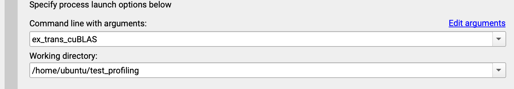

# Objectives

The goal is to understand GPU performance in the context of an LLM using cuda:

1 - Understanding how memory is allocated and freed helps you grasp why models are sharded across GPUs.

2 - When loading an LLM checkpoint, the system performs many cudaMemcpy-like operations to move model parameters to GPU.

3 - Every step of setp of an LLM involve CUDA operations: memory management, kernel launches, synchronization (token embedding, Q K V matrix projection, attention layer, feed forward layer, result copied back)


## Prerequisites

Make sure you have the following:

1 - NVIDIA GPU with CUDA Compute Capability: https://developer.nvidia.com/cuda-gpus

2 - CUDA Toolkit download and install the version compatible with your GPU and OS: https://developer.nvidia.com/cuda-downloads

3 - Nvidia Nsight: https://developer.nvidia.com/nsight-systems/get-started

4 - Nvidia Compute: https://developer.nvidia.com/tools-overview/nsight-compute/get-started

3 - Verify installation

```bash
nvcc --version       # Should show the CUDA compiler version
ncu --version # Should show the version of Nsight Compute
nvidia-smi           # Shows your GPU and driver status
```
## Workflow

#### Option 1:

This option works well if you are familiar with cuda code and want to write your own kernel.

First, compile .cu (cuda) file using cuda compiler nvcc

```bash
nvcc -o matmul matmul.cu # -o is the compiled file name 
```

Then, from Nvidia Nsight enter the compiled program in the command line and indicate your working directory



A new tab will open with profiling data. This option is great when writing low level code in cuda. All cuda kernel calls will be shown in addition to other information. 
In case you are not familiar with cuda or you want to import a pre trained model with a python librairy, see option 2.

#### Option 2:

Option 2 allows you to execute python code on gpu and profile the activity. For some reason I ran into a problem when trying to profile python code via Nsight System GUI, where I could not see gpu and cuda data in the timeline eventhough the data was collected. Additionally, being on mac I don't have full access to the GUI version limiting my options to only remote live monitoring (no data import)

I propose here an alternative approach. In the CLI, profile your python program with the following script:

```
nsys profile --trace=cuda,cudnn,cublas --output=output_file_name.nsys-rep python your_program_name.py
```
Then this command gives you a detailed overview of the data collected and output in a text file

```
nsys stats your_report_name.nsys-rep > output_text.txt
```

The .nsys-rep file contains sql profiling data and it is extracted in a text file with the command stats. 
It is then possible to analyze and extract key information about kernel and cuda api calls.


#### Additional Profiling Option

Installing Nsight Compute it is possible to obtain more profiling information when running a script. 


Run this command to profile your script with Nsight Compute
```
ncu --target-processes all python3 your_program.py
```

It will output an ncu-rep file that you can scp back to your machine. Having the full version available of Nsight Compute on Mac allow you to upload your ncu-rep file in the profiler.

For a quick analysis or if you don't have access to the full version you can output the profiler data in a txt file with this command

```
ncu --target-processes all python3 your_program.py > report.txt
```


